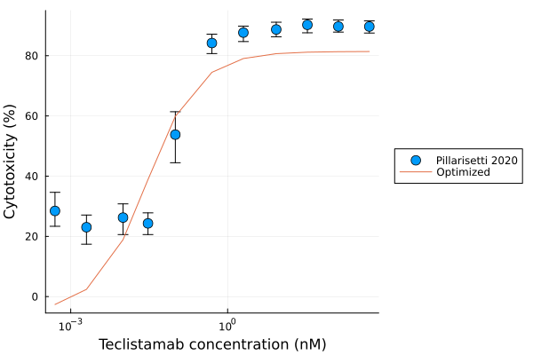
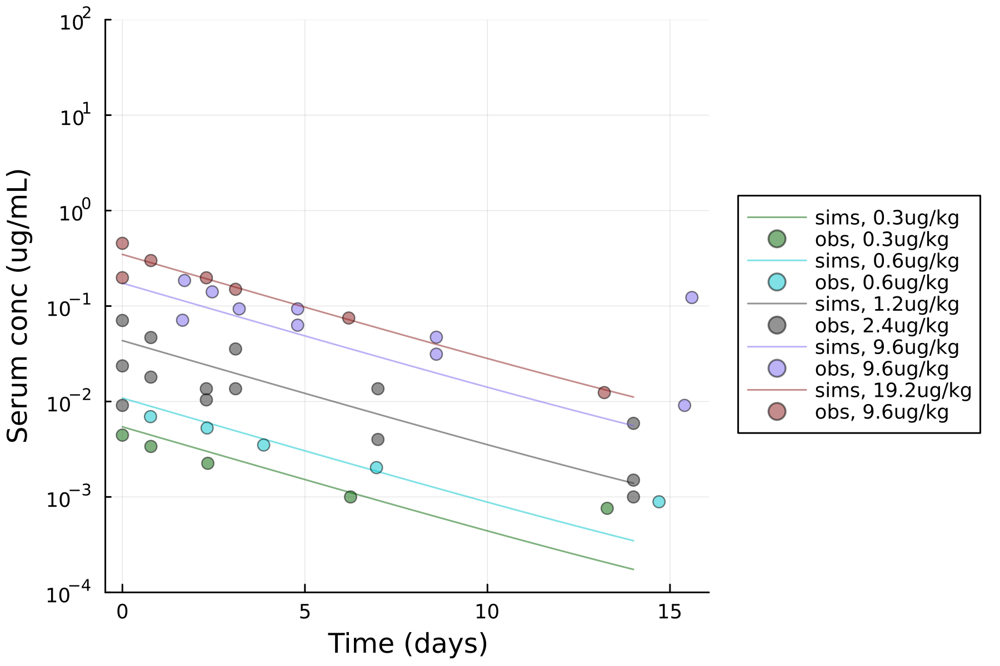
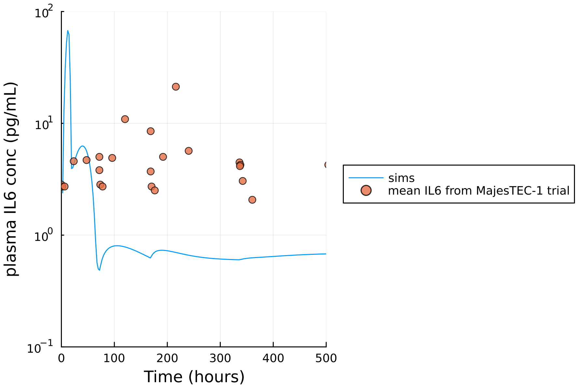

# Purpose of this folder

The goal was to explore how well parameters from [Hosseini et al., 2020](https://www.nature.com/articles/s41540-020-00145-7) explain IL6 observed across other TCEs, in human and in NHP. 

- The Hosseini model was initial parameterized to describe plasma IL6 concentration after mosunetuzumab IV dosing (in human and in NHP). 

- The Hosseini model predicted plasma IL6 concentration reasonably for epcoritamab after IV dosing (in human). 

- The Hosseini model under-predicted plasma IL6 concentration for glofitamab after IV dosing (in NHP). 

- The Hosseini model under-predicted plasma IL6 concentration for teclistamab after sc dosing.

## IL6 exploration for epcoritamab

Epcoritamab, similar to mosunetuzumab, was a IgG-1 based bsAb with CD3-binding domain on 1 arm, and CD20-binding domain on the other arm (see [illustration](https://events.jspargo.com/ASH22/CUSTOM/EPCOREVirtualBrochure.pdf)). Clinical IL6 production during the course of treatment was reported in [Hutchings et al., 2021](https://www.thelancet.com/journals/lancet/article/PIIS0140-6736(21)00889-8/abstract). 

Here, we aim to explore if the Hosseini model could predict IL6 production in epcoritamab. Parameters for epcoritamab was obtained from [Boni et al., 2024](https://ascopubs.org/doi/10.1200/JCO.2024.42.16_suppl.e19059). In vitro cytotoxicity was compared to [Engelberts et al., 2020](https://pubmed.ncbi.nlm.nih.gov/31981978/) (Figure 1A). Clinical dosing scheme of epcoritamab was obtained from [Hutchings et al., 2021](https://www.thelancet.com/journals/lancet/article/PIIS0140-6736(21)00889-8/abstract) (PK shown in Figure 1B). Predicted T cell count (Figure 1C) and IL6 (Figure 1D) were compared to the observed values. Predicted T cell count was higher than what was observed in clinical population, but roughly following the pattern of T cell depletion after each injection, though long-term T cell count in patients were observed to increase, while the prediction showed trend of decrease. This indicate that the Hosseini model might not be fully calibrated for this patient population (e.g. not calibrated towards prior treatment). Predicted IL6 concentration is in the range of observed values. The predicted B cell depletion was faster than what was observed, but this might be due to prior anti-CD20 treatment patients received but was not calibrated in the model. 

<table>
    <tr>
        <td> Figure 1A. In vitro cytotoxicity of epcoritamab. </td>
        <td> Figure 1B. Predicted clinical PK of epcoritamab. </td>
    </tr>
    <tr>
        <td>  </td>
        <td>  </td>
    </tr>
    <tr>
        <td> Figure 1C. Predicted vs observed peripheral blood T cell count. </td>
        <td> Figure 1D. Predicted vs. observed plasma IL6. </td>
    </tr>
    <tr>
        <td>  </td>
        <td>  </td>
    </tr>
</table>

## IL6 exploration for glofitamab 

Glofitamab differs from mosunetuzumab in the 2 binding domains it has for CD20, with one of the CD20-binding domain was linked to CD3 binding domain in a head-to-tail form. In vitro cytotoxicity fitting was provided in Figure 2A, with parameters obtained from [Li et al., 2024](https://www.metrumrg.com/wp-content/uploads/2024/04/AACR-2024-QSP-ModelingBispecific-d4.0.pdf). The human version of the Hosseini model predicted T cell fold of change well (Figure 2B). 

IL6 concentration on glofitamab production in clinical setting is to be reported. IL6 production from cyno was reported in [Frances et al., 2022](https://pubmed.ncbi.nlm.nih.gov/34953862/). Using cyno parameters provided in [Hosseini et al., 2020](https://www.nature.com/articles/s41540-020-00145-7) and PK parameters from [Li et al., 2024](https://www.metrumrg.com/wp-content/uploads/2024/04/AACR-2024-QSP-ModelingBispecific-d4.0.pdf), the cyno PK can be well-captured in the model (Figure 2C), but the predicted IL6 concentration is much lower than the observed (Figure 2D). 

<table>
    <tr>
        <td> Figure 2A. Glofitamab in vitro cytoyoxicity </td>
        <td> Figure 2B. T cell change in peripheral blood (human), predicted vs observed </td>
    </tr>
    <tr>
        <td>  </td>
        <td>  </td>
    </tr>
    <tr>
        <td> Figure 2C. Glofitamab PK (cyno) </td>
        <td> Figure 2D. IL6 concentration (cyno) </td>
    </tr>
    <tr>
        <td>  </td>
        <td>  </td>
    </tr>
</table>

## IL6 exploration for teclistamab 

Teclistamab is a T-cell–redirecting bispecific antibody that targets both CD3 expressed on the surface of T cells and B-cell maturation antigen (BMCA) expressed on the surface of myeloma cells. The in vitro fitting of teclistamab for Hosseini model is shown in Figure 3A. Observed clinical PK and their corresponding values were obtained from [FDA BLA file](https://www.accessdata.fda.gov/drugsatfda_docs/nda/2022/761291Orig1s000MultidisciplineR.pdf), with both intravenous (IV) and subcutaneous (SC) dosing PK verified (Figure 3B, 3C). 

IL6 change after receiving teclistamab was reported in [Moreau et al., 2022](https://www.nejm.org/doi/full/10.1056/NEJMoa2203478), but only in fold-of-change (Supp Figure 4): the fold of change is somewhere between 0.3 and 512 folds. Assuming IL6 concentration pre-treatment is 5.186 pg/mL ([Said et al., 2021](https://pubmed.ncbi.nlm.nih.gov/33155686/)), then the peak IL6 concentration after teclistamab would be between 1.5 pg/mL and 2655.23 pg/mL. Prediction from Hosseini model (Figure 3D) lies in this range. However, the peak time appeared to differ from the mean IL6 concentration (Figure 3D). 

<table>
    <tr>
        <td> Figure 3A. Teclistamab in vitro cytoyoxicity </td>
        <td> Figure 3B. Clinical PK after IV dosing, predicted vs observed </td>
    </tr>
    <tr>
        <td>  </td>
        <td>  </td>
    </tr>
    <tr>
        <td> Figure 3C. Clinical PK after SC dosing, predicted vs observed </td>
        <td> Figure 3D. Predicted IL6 concentration after SC dosing. </td>
    </tr>
    <tr>
        <td>  </td>
        <td>  </td>
    </tr>
</table>

# Content of the repo 

- data: Folder that hosts data digitized from literature
- deliv: Folder that hosts outputs
- doc: relevant literature
- model: 
    - `param.jl`: default parameters for Hosseini model on mosumetuzumab (human)
    - `ParamUpdate.jl`: update in vitro mosumetuzumab parameters for epcoritamab or glofitamab
    - `tdb_homo.jl`: final version of Hosseini model (human)
    - `tdb-in-vitro-hosseini.jl`: semimechanistic in vitro model (isolated from the Hosseini model)
- script: 
    - `epcoritamab_in_vitro_hosseini.jl`: in vitro simulation for epcoritamab of the semimechanistic model 
    - `epcoritamab_in_vitro_mechanistic.jl`: in vitro parameter fitting for epcoritamab of the mechanistic model 
    - `glofitamab_in_vitro_hosseini.jl`: in vitro simulation for glofitamab of the semimechanistic model 
    - `hosseini-epco-il6.jl`: T cell count and IL6, predicted vs observed
    - `hosseini-glofit-il6-cyno.jl` 
    - `hosseini-glofit-tcellchange.jl`: Peripheral blood T cell change, predicted vs observed (human)
    - `mosunetuzumab_in_vitro_mechanistic.jl`: parameter optimization, visualization, and local sensitivity analysis for mechanistic model for mosunetuzumab
    - `teclistamab_hossini.jl`: teclistamab pk verification (parameters obtained from teclistamab FDA BLA)
    - `teclistamab_in_vitro_hosseini.jl`: in vitro parameter optimization for the seminmechanistic model 

