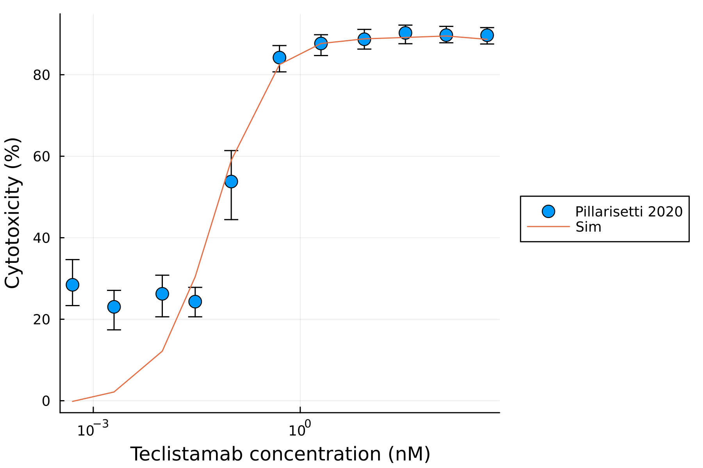
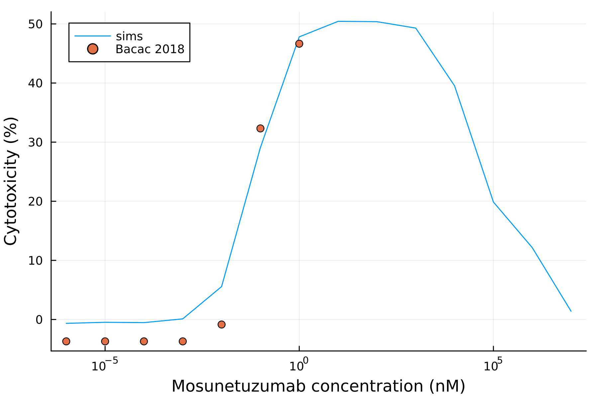
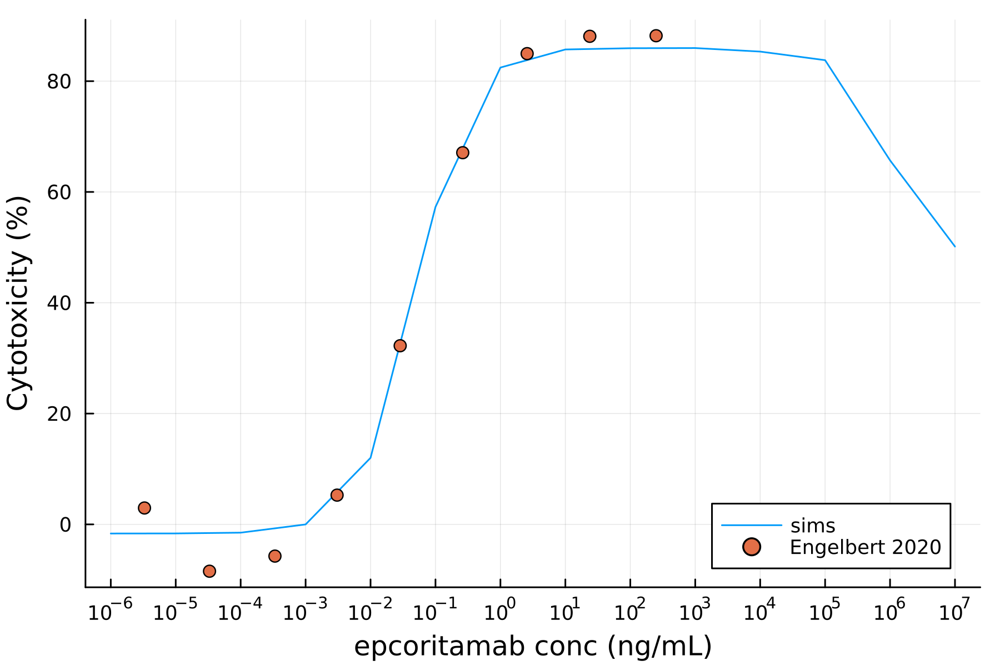

# Mechanistic in vitro model for T cell engager (TCE), or T cell dependent bispecific anitbody (TDB)

This repo is used to explore simulation results on T cell dependent bispecific antibodies (TDB) and antibody drug conjugate (ADC). The model was adapted from [Utsey et al., 2023](https://www.metrumrg.com/wp-content/uploads/2023/11/poster-final.pdf) with the killing adjusted with a Hill function ([Jiang et al., 2018](https://pubmed.ncbi.nlm.nih.gov/29985776/)).

3 different TCE parameterization was provided in this repo: teclistamab, mosunetuzumab, epcoritamab. 

<table>
    <tr>
        <th> Figure 1A. Teclistamab </th>
        <th> Figure 1B. Mosunetuzumab </th>
        <th> Figure 1C. Epcoritamab </th>
    </tr>
    <tr>
        <td>  </td>
        <td>  </td>
        <td>  </td>
    </tr>
</table>

# Content of this folder

| Script    | Description |
| -------- | ------- |
| `tce_invitro_cleanup.jl` | FINAL model script |
| `run_epcoritamab.jl` | run script for epcoritamab |
| `run_mosunetuzumab.jl` | run script for mosunetuzumab |
| `run_teclistamab.jl` | run script for teclistamab |
