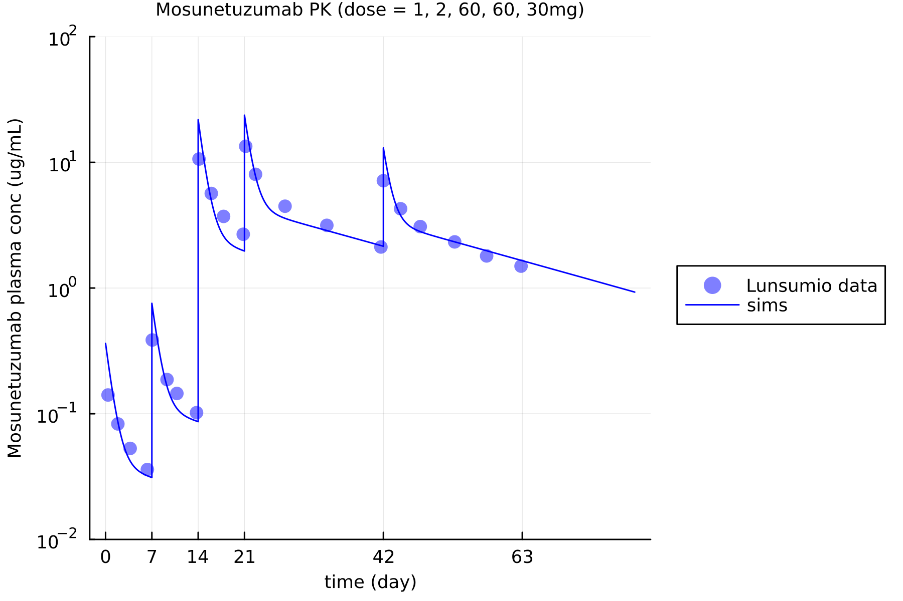

Implementations of the model in [Hosseini et al., 2020](https://www.nature.com/articles/s41540-020-00145-7), with multiple version using `ModelingToolkit` in julia v.1.10.2. 

PK comparison is included here. 

Note in this model, the tumor compartment was turned off. If anti-tumor activity wishes to be explored, the tumor compartment should be turned on.

Content of this folder: 
- `hosseini-cyno.jl`. Update parameters for human for parameters to cyno. 
- lunsumio-pk-genetech.csv. Digitized PK value of mosunetuzumab (digitized from [perscribing label](https://www.accessdata.fda.gov/drugsatfda_docs/label/2022/761263s000lbl.pdf)). 
- `pk-mosun.jl`. Run file to generate PK validation of the model. 
- README.md. This readme file. 
- `tdb_homo.jl`. Final version of the cleaned up Hosseini model (e.g. removed all unused, undocumented parameters, removed RTX and related terms, and placeholder terms). 

Additional exploration and documentation of this model can be found in the following repo, and project works that used this model: 
- [https://ghe.metrumrg.com/yuezhel/TDB-explore](https://ghe.metrumrg.com/yuezhel/TDB-explore)
- [svn+ssh://yuezhel@mc1.metrumrg.com/common/repo/svn-proj-adc0304f](svn+ssh://yuezhel@mc1.metrumrg.com/common/repo/svn-proj-adc0304f)
- [svn+ssh://yuezhel@mc1.metrumrg.com/common/repo/svn-proj-ADC-0601](svn+ssh://yuezhel@mc1.metrumrg.com/common/repo/svn-proj-ADC-0601)
- [svn+ssh://yuezhel@mc1.metrumrg.com/common/repo/svn-proj-adc0501](svn+ssh://yuezhel@mc1.metrumrg.com/common/repo/svn-proj-adc0501)
